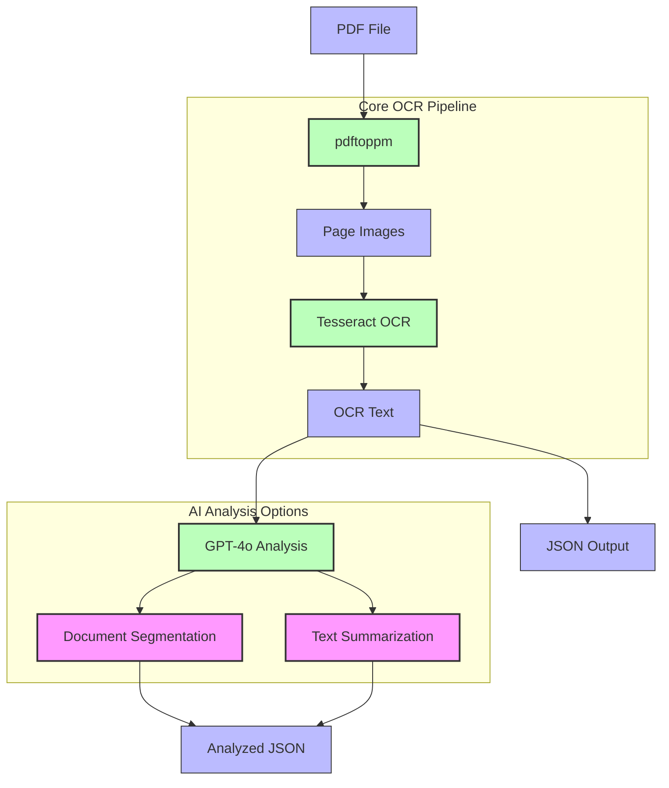

```mermaid
flowchart TD
    PDF[PDF File] --> PDFTOPPM[pdftoppm]
    PDFTOPPM --> IMAGES[Page Images]
    IMAGES --> TESSERACT[Tesseract OCR]
    TESSERACT --> OCR_TEXT[OCR Text]
    OCR_TEXT --> PURE_JSON[JSON Output]
    OCR_TEXT --> GPT4O[GPT-4o Analysis]
    GPT4O --> SEGMENTATION[Document Segmentation]
    GPT4O --> SUMMARIZATION[Text Summarization]
    SEGMENTATION --> ANALYZED_JSON[Analyzed JSON]
    SUMMARIZATION --> ANALYZED_JSON

    subgraph "Core OCR Pipeline"
        PDFTOPPM
        IMAGES
        TESSERACT
        OCR_TEXT
    end

    subgraph "AI Analysis Options"
        GPT4O
        SEGMENTATION
        SUMMARIZATION
    end

    classDef process fill:#f9f,stroke:#333,stroke-width:2px;
    classDef data fill:#bbf,stroke:#333,stroke-width:1px;
    classDef external fill:#bfb,stroke:#333,stroke-width:2px;
    
    class PDFTOPPM,TESSERACT,GPT4O external;
    class PDF,IMAGES,OCR_TEXT,PURE_JSON,ANALYZED_JSON data;
    class SEGMENTATION,SUMMARIZATION process;
```