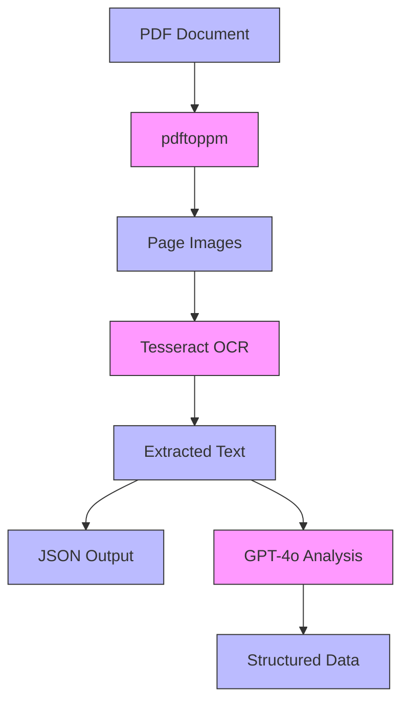

```mermaid
graph TD
    A[PDF Document] --> B[pdftoppm]
    B --> C[Page Images]
    C --> D[Tesseract OCR]
    D --> E[Extracted Text]
    E --> F[JSON Output]
    E --> G[GPT-4o Analysis]
    G --> H[Structured Data]
    
    classDef process fill:#f9f,stroke:#333,stroke-width:1px;
    classDef data fill:#bbf,stroke:#333,stroke-width:1px;
    classDef external fill:#bfb,stroke:#333,stroke-width:1px;
    
    class B,D,G process;
    class A,C,E,F,H data;
```