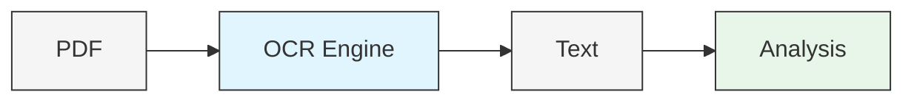

# PDF OCR Pipeline

Extract text from PDFs and analyze with AI.

## Quick Start

```bash
# Install the tool
pip install pdf-ocr-pipeline

# Extract text from a PDF
pdf-ocr document.pdf > text.json

# Extract and analyze with AI
pdf-ocr document.pdf | pdf-ocr-summarize > analysis.json
```

## What You Can Do

<div class="grid cards">
  <a href="tasks/extract-text/">
    <div class="card">
      <div class="title">Extract Text</div>
      <div class="description">Convert scanned PDFs to searchable text</div>
    </div>
  </a>
  <a href="tasks/analyze-documents/">
    <div class="card">
      <div class="title">Analyze Content</div>
      <div class="description">Extract structured data with AI</div>
    </div>
  </a>
  <a href="tasks/segment-documents/">
    <div class="card">
      <div class="title">Segment Documents</div>
      <div class="description">Identify separate documents in a PDF</div>
    </div>
  </a>
  <a href="tasks/batch-process/">
    <div class="card">
      <div class="title">Batch Process</div>
      <div class="description">Handle multiple PDFs efficiently</div>
    </div>
  </a>
</div>

## How It Works



1. **Convert** PDFs to images
2. **Extract** text with OCR
3. **Analyze** content with AI (optional)

## Installation

```bash
# Install the package
pip install pdf-ocr-pipeline

# You'll need these external tools:
# - pdftoppm (from poppler-utils)
# - tesseract (OCR engine)
```

For full installation instructions, see [Installation Help](help/installation.md).