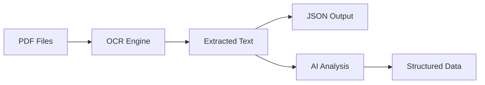

# User Guide

This guide covers all the essential features of PDF OCR Pipeline and explains how to use them effectively.

## Overview

PDF OCR Pipeline works in two main steps:

1. **OCR Processing**: Convert PDF files to machine-readable text
2. **Text Analysis** (optional): Process the extracted text with AI

## Use Cases

- **Document Digitization**: Convert paper documents to searchable text
- **Data Extraction**: Extract key information from large document collections
- **Document Segmentation**: Identify separate documents in multi-page PDFs
- **Text Analysis**: Summarize and structure information from scanned documents

## Basic Workflow

The standard workflow looks like this:

1. Prepare your PDF files
2. Run OCR with `pdf-ocr`
3. Optionally analyze the text with `pdf-ocr-summarize` or `pdf-ocr-segment`
4. Process the resulting JSON data

## Sections

- [Command Line Interface](command-line.md) - Using the CLI tools
- [OCR Options](ocr-options.md) - Configuring the OCR process
- [AI Analysis](ai-analysis.md) - Using AI to analyze extracted text
- [Programming](programming.md) - Using PDF OCR Pipeline in Python code